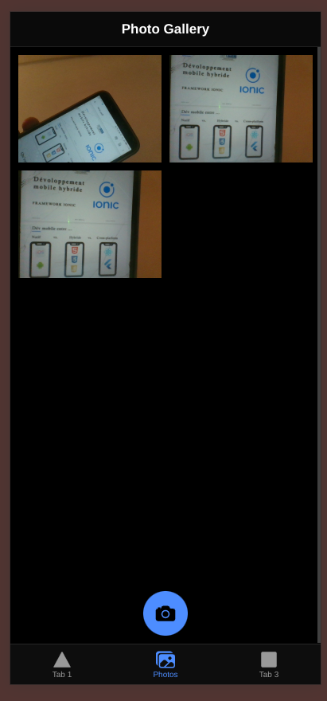
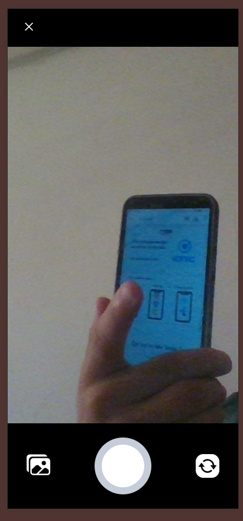

# 📸 Ionic Photo Gallery App

## 🖼️ Screenshots

### 📱 Photo Capture Interface


### 🖼️ Gallery Display


A simple mobile application built with **Ionic Framework** and **Angular** that allows users to take photos with their device's camera, display them in a gallery grid, and save them locally using Capacitor plugins.

## 🚀 Features
- Capture photos using the camera
- Display photos in a responsive gallery
- Save photos to local storage with Capacitor
- Tab-based UI navigation

## 🛠️ Tech Stack
- Ionic + Angular
- Capacitor (Camera, Filesystem, Preferences)
- HTML, SCSS, TypeScript

## 📦 Installation

```bash
npm install -g @ionic/cli
ionic start photo-gallery tabs --type=angular --capacitor
cd photo-gallery
npm install
npm install @capacitor/camera @capacitor/preferences @capacitor/filesystem
ionic build
ionic cap add android
ionic cap run android
